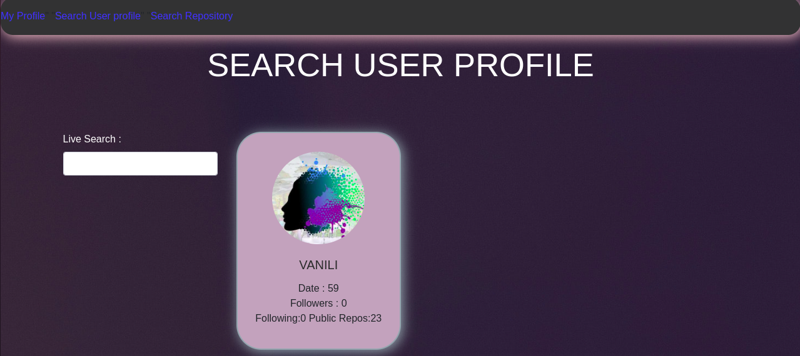

# GitApp

This project was generated with [Angular CLI](https://github.com/angular/angular-cli).

## Author
Kate Vanili

## Development server

Run `ng serve` for a dev server. Navigate to `http://localhost:4200/`. The application will automatically reload if you change any of the source files.

## Code scaffolding

Run `ng generate component component-name` to generate a new component. You can also use `ng generate directive|pipe|service|class|guard|interface|enum|module`.

## Build

## Technologies

---

- Angular
- Typescript
- Javascript
- CSS
- Bootstrap
- HTML

### Setup Environment

1. Clone the repo : `https://github.com/VaniliKate/git-app.git`
2. Run `npm install`
3. Run `ng serve --open` to run the app in your favourite browser

## Running unit tests

Run `ng test` to execute the unit tests via [Karma](https://karma-runner.github.io).

## Running end-to-end tests

Run `ng e2e` to execute the end-to-end tests via a platform of your choice. To use this command, you need to first add a package that implements end-to-end testing capabilities.

## Further help

To get more help on the Angular CLI use `ng help` or go check out the [Angular CLI Overview and Command Reference](https://angular.io/cli) page.

## project link

https://git-app-umber.vercel.app/
